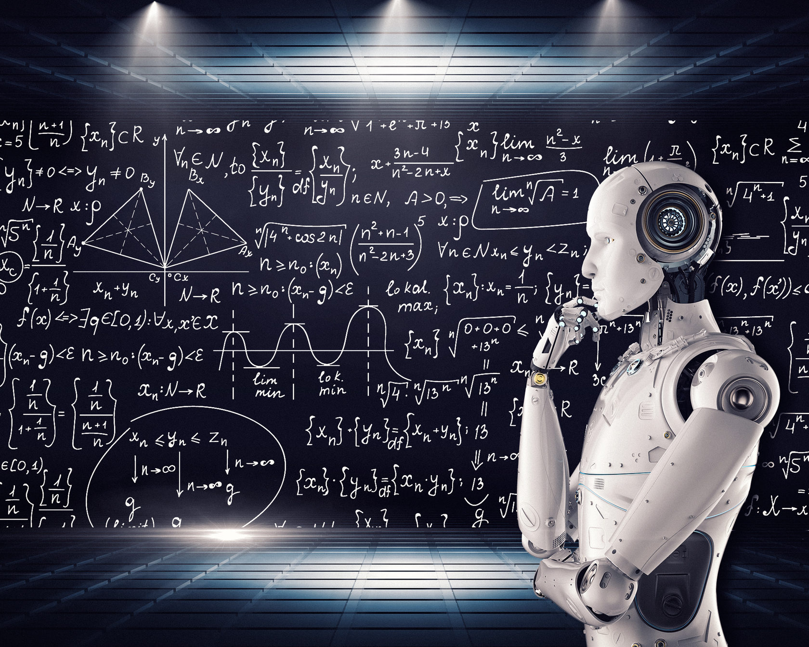

# ITMO University Machine Learning Course  
### List with topics of laboratory works    
1. Numpy and Python's basic functions
2. Pandas and DataFrames
3. Linear and Polynomial Regression
4. Decision trees and Random Forest
5. NLP
6. Neuron with activation functions
7. PyTorch Framework and Fashion MNIST

